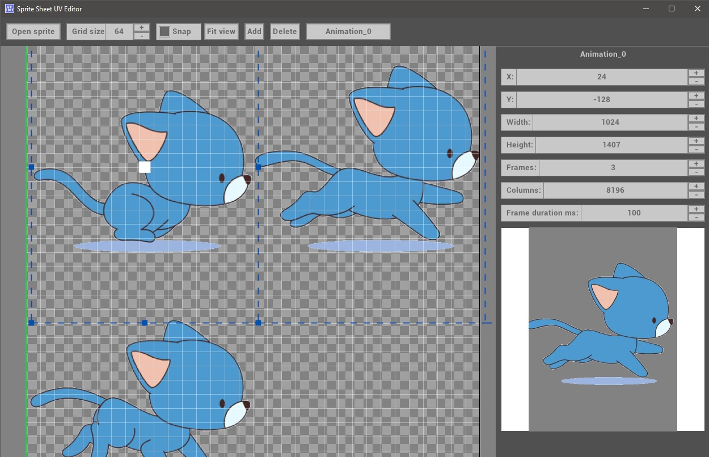

#  Sprite UV Editor

This is a hobby project created because I needed a simple way to map sprites to sprite-sheets or sprite-atlas and I this app will speed-up the process.
You may/will encounter bugs, feel free to open an issue.

## Supported platforms
 - Windows
 - Linux (not tested yet)
 - MacOS (not tested yet either)

## Features
- 2D viewport easy navigation with easy mouse panning and zooming.
- Map sprites coordinates to an image and define the sprite sheet matrix and speed animation. 
- Grid snapping.
- Realtime animation preview.
- Json animations export.
- Keyboard shortcuts.
- Undo/redo.

## Releases
Download the latest release from [releases](https://github.com/VolpinGames/SpriteUVEditor/releases).

## Building
Use cmake to build the project.

Dependencies handled by cmake fetch content:
 - Raylib
 - Raygui
 - Nlohmann::json
 - Tinyfiledialogs

## Requirements
 - CMake at least version 3.15
 - At least C++17 compiler

## Contributing
Feel free to contribute to the project by creating a pull request.

## License

MIT License

Copyright (c) 2025 Kirichenko Stanislav

Permission is hereby granted, free of charge, to any person obtaining a copy
of this software and associated documentation files (the "Software"), to deal
in the Software without restriction, including without limitation the rights
to use, copy, modify, merge, publish, distribute, sublicense, and/or sell
copies of the Software, and to permit persons to whom the Software is
furnished to do so, subject to the following conditions:

The above copyright notice and this permission notice shall be included in all
copies or substantial portions of the Software.

THE SOFTWARE IS PROVIDED "AS IS", WITHOUT WARRANTY OF ANY KIND, EXPRESS OR
IMPLIED, INCLUDING BUT NOT LIMITED TO THE WARRANTIES OF MERCHANTABILITY,
FITNESS FOR A PARTICULAR PURPOSE AND NONINFRINGEMENT. IN NO EVENT SHALL THE
AUTHORS OR COPYRIGHT HOLDERS BE LIABLE FOR ANY CLAIM, DAMAGES OR OTHER
LIABILITY, WHETHER IN AN ACTION OF CONTRACT, TORT OR OTHERWISE, ARISING FROM,
OUT OF OR IN CONNECTION WITH THE SOFTWARE OR THE USE OR OTHER DEALINGS IN THE
SOFTWARE.
